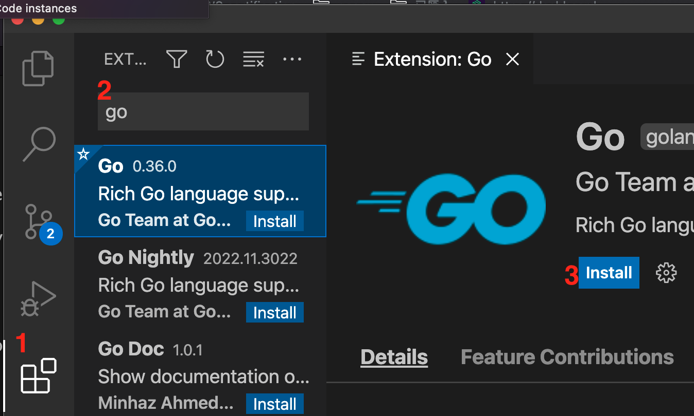
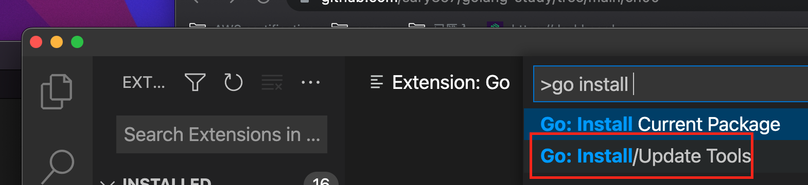
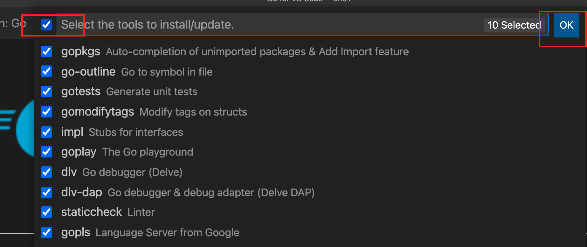

# Go installation (On Mac)
- install with `homebrew`.

```
$ brew install go
Running `brew update --auto-update`...
==> Auto-updated Homebrew!
Updated 5 taps (aquasecurity/trivy, hashicorp/tap, homebrew/core, homebrew/cask and argoproj/tap).
==> New Formulae

```

- verify the installation with `go version`.

```
$ go version
go version go1.19.3 darwin/amd64

```

# Configure vscode

- Step 1. click `Extension`
- Step 2. type `Go`
- Step 3. choose the 1st item and click `Install`
----

- Step 4. Alt + Shift + P
- Step 5. type `go install`
- Step 6. choose `Go: install/Update Tools`
----

- Step 7. choose `all`
- Step 8. click `OK` on right
----
- When you see the following message, it means you already install all tools successfully.
```
All tools successfully installed. You are ready to Go :).
```
